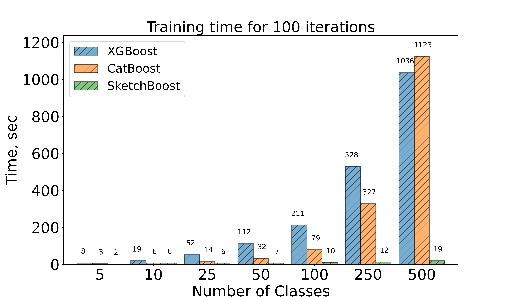

## SketchBoost: Fast Gradient Boosted Decision Tree for Multioutput Problems




### Introduction

This repository is created to reproduce the experimental results from the eponymous paper. It contains the training and evaluation scripts and Jupyter Notebooks for launching and analyzing the experiments. It uses our custom GBDT implementation described below.

### SketchBoost

We implemnented a simple and fast library for training GBDTs on GPU called [Py-Boost](https://github.com/sb-ai-lab/Py-Boost). It is open-source and available on the [GitHub](https://github.com/sb-ai-lab/Py-Boost) and [PyPi](https://pypi.org/project/py-boost/). The main feature of the implementation is that it is written in Python, and hence can be easily customized for one's needs. **SketchBoost** is a part of **Py-Boost** library. This is the version of GBDT based on pure **Py-Boost** implemetation with the built in sketching strategies for multioutput training described in the paper.


### Requirements

All the GBDT and neural network implementations used in the benchmark are launched in GPU mode (except **CatBoost** for the multilabel classification and multitask regression datasets), so NVidia GPU is required. Single Tesla V100 32GB was used to obtain the results from the paper, but 16GB memory GPUs should also be enough to run all the tasks. In our experiments, we used 4 GPU to run tasks in parallel.

Python 3.8 and Ubuntu 18.04 was used to run the benchmark, but Python 3.7-3.9 and any Linux should also be ok. It is recommended to run all code in the isolated environment. To setup environment and also get the training data, run the following:


```bash
# Create env. Assume python is Python 3.7-3.9
python -m venv sb_env
# Activate and run all next code inside the env
source sb_env/bin/activate
# Replace with cupy-cudaXXX where XXX is your cuda version
pip install cupy-cuda110
# Setup env
bash setup_env.sh
# Download and preprocess train data
bash get_data.sh

```
**Note**: this code installs CuPy assuming that you have CUDA v11.0. Otherwise, please replace the version of cuda for `cupy-cuda110` package. For details, please see this [guide](https://docs.cupy.dev/en/stable/install.html).


### Main Experiment

In this experiment, we evaluate SketchBoost strategies on 9 multioutput datasets. **CatBoost** and **XGBoost** are executed on GPU for all tasks where it was possible. The exception is multilabel classification and multitask regression for **CatBoost** framework (not supported). Those experiments are evaluated on CPU (8 threads per task). The experiments provided in the present paper consists of the following steps that need to be executed sequentially:

* Hyperparameter tuning for the baseline **CatBoost** and **XGBoost** models. To execute this step, please run `python optimize_hyperparams.py -n 4` where `n` stands for number of tasks run in parallel. It takes quite a long time (about 3 days or a little more on 4 V100 GPUs). If you want to skip step, the best parameters found  are provided in `runs/baselines_and_params.pkl` file. 

* Refit the baseline **CatBoost** and **XGBoost** models for the best parameters with lower learning rate and more boosting rounds. To execute this step, please run `python refit_baselines.py -n 4`. This step takes about 2 days on 4 V100 GPUs.

* Evaluate **SketchBoost**. To execute this step, please run `python skboost_bench.py -n 4`. This step takes about 15 hours on 4 V100 GPUs.

**Note**: Here and subsequently, `-n 4` stands for the number of tasks run is parallel. Each task uses 8 CPU threads and single GPU (if GPU is used). In case of more available resourses, you can increase this number to speed up the training process.


### GBDT-MO Experiment

In this experiment, we evaluate **GBDT-MO**, **CatBoost**, and **SketchBoost** on the datasets from the [paper](https://arxiv.org/pdf/1909.04373.pdf). SketchBoost runs on GPU, others -- on CPU:

* To evaluate **GBDT-MO** and **GBDT-MO (sparse)**, run `python gbdtmo_baseline.py -n 4`.

* To evaluate **CatBoost**, run `python gbdtmo_catboost.py -n 4`.

* To evaluate **SketchBoost**, run `python gbdtmo_skboost.py -n 4`.

**Note**: **GBDT-MO** may face some issues with run under the **Google Colab** or **Conda** environments. Details are given [here](https://github.com/zzd1992/GBDTMO-EX/issues/10) and [here](https://github.com/zzd1992/GBDTMO/issues/20).

### TabNet Experiment

In this part we can optionally add [TabNet](https://arxiv.org/pdf/1908.07442.pdf) to the Main Experiment. Evaluation on GPU, takes about 3 days on 4 V100

* To evaluate **TabNet**, run `python optimize_hyperparams_tabnet.py -n 4`.


### Visualization

All the figures and tables from the paper and the Supplementary Material can be plotted in the following way.

* To visualize the main experimental results, run **RESULTS_MAIN_W_TABET.ipynb** if you perform **TabNet** evaluation, otherwise **RESULTS_MAIN.ipynb**.

* To visualize the GBDT-MO experimental results, run **RESULTS_GBDTMO.ipynb**.

* To plot Figure 1, run `python plot_cb_vs_xgb.py`. Output will be saved in `./output` folder.

* To plot Figure 3, run `python plot_learning_curve.py`. Output will be saved in `./output` folder.